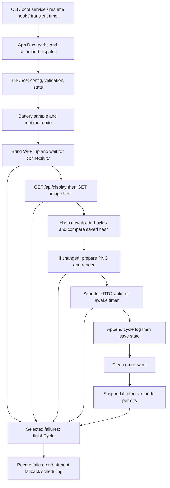

# Architecture map

Updated for completed extraction on 2026-09-14. The shared checkout's uncommitted Wi-Fi SDIO and stock-noise work is excluded. Delivery and device verification are tracked in [the phase plan](refactoring-plan.md); remaining risks live in [technical debt](tech-debt.md).

## Shape and entrypoints

One Go module, `github.com/robinsandborg/rm1-trmnl`, declares Go 1.26 and depends on `golang.org/x/image v0.39.0` for BMP decoding. Eleven packages form the implementation:

| Package | Responsibility |
| --- | --- |
| `cmd/trmnl-rm1` | Process entrypoint. |
| `cmd/trmnl-power-report` | Standalone read-only cycle-log report entrypoint. |
| `internal/diagnostics` | Filtered cycle summaries and sampled discharge windows, with private log fields omitted. |
| `internal/trmnl` | CLI compatibility, persisted DTOs/defaults, and composition adapters. |
| `internal/cycle` | One-shot state transitions, refresh cadence, effects ordering, and failure finalization. |
| `internal/byos` | HTTP display/image exchange and refresh interval policy. |
| `internal/display` | Portable image preparation and platform renderer commands. |
| `internal/storage` | Paths, JSON file I/O, raw cache writes, and JSONL append. |
| `internal/network` | Wi-Fi identity, link commands, connectivity, and acquisition/cleanup. |
| `internal/power` | Runtime mode, battery, RTC/awake scheduling, and suspend. |
| `internal/appliance` | Install/restore sequencing, stock-service snapshot, and artifact templates. |

Appliance dependencies flow from the executable through `trmnl` to the internal modules. `cycle` uses display and power value types and receives composed operations; no extracted module imports `trmnl`. The separate `trmnl-power-report` executable uses only `diagnostics` and the standard library, without runtime/device effects. There is no Makefile. [CI](../.github/workflows/checks.yml) runs macOS/Linux tests and vet plus ARMv7 compilation of both executables and all package tests.

| Entrypoint | Implementation and effects |
| --- | --- |
| CLI process | [`cmd/trmnl-rm1/main.go`](../cmd/trmnl-rm1/main.go) constructs `trmnl.NewApp`, calls `Run`, prints errors to stderr, exits 1 on error. |
| `trmnl-power-report` | [`cmd/trmnl-power-report/main.go`](../cmd/trmnl-power-report/main.go) reads JSONL from stdin, accepts optional RFC3339 `-since`/`-until` boundaries, and emits versioned redacted JSON. No config/state/device writes. See [battery measurement](battery-life.md). |
| Command dispatch | [`App.Run`](../internal/trmnl/app.go) resolves XDG paths and creates runtime directories before dispatch, including for invalid commands. |
| `validate` | Loads defaults and JSON, validates effective configuration and device identity; prints `config is valid`. |
| `print-device-id` | Prints configured identity or Linux wireless MAC fallback. |
| `run-once` | One fetch/render/schedule cycle; no resident polling loop. |
| `install-appliance` | [`install_linux.go`](../internal/trmnl/install_linux.go) writes systemd unit and resume hook, changes stock services, saves restore metadata, starts appliance service. Rejects arguments. |
| `restore-stock` | Linux entrypoint delegates to [`runRestoreWithOps`](../internal/trmnl/install_common.go); removes appliance artifacts and restores stock services with aggregated errors. |
| Boot/resume | Generated `trmnl-rm1-appliance.service` runs the executable with `run-once`, root, and `HOME=/home/root`. The sleep hook's `post` case uses `systemctl start --no-block`. |
| Awake next cycle | [`power/power_linux.go`](../internal/power/power_linux.go) alternates `trmnl-rm1-next-a` and `trmnl-rm1-next-b` timer/service names, avoiding the current unit. |
| Deployment | [`deploy/deploy.sh`](../deploy/deploy.sh) copies binary/config over SSH, sets maintenance, validates and runs a cycle; optional `appliance` installs and clears maintenance. [`bootstrap-ssh-key.sh`](../deploy/bootstrap-ssh-key.sh) bootstraps access. |

## Runtime flow



`runOnce` loads and validates config, then loads state. `cycle.Run` samples battery best-effort. Linux runtime mode precedence is sentinel maintenance, active USB network, boot grace, failure recovery, then appliance. USB activity uses `operstate=up` or `carrier=1`; merely having a MAC is insufficient.

[`internal/byos.Fetch`](../internal/byos/fetch.go) owns the display exchange. The [`trmnl` facade](../internal/trmnl/byos.go) resolves device identity, supplies effective refresh durations and the existing HTTP client, and maps results to the unchanged `TerminalResponse` return shape. The display request sends `ID`, optional `access-token`, and `User-Agent: trmnl-rm1/0.1.0`. `TerminalResponse` reads `image_url`, `filename`, and `refresh_rate` (seconds). Relative image URLs resolve against `base_url`. The separate image GET does not explicitly attach the display headers. A configured HTTP client timeout applies to requests.

Raw downloaded bytes determine the SHA-256 hash. Even unchanged payloads are downloaded and written to the cache; rendering and the rendered-update counter are skipped. A changed image gets a full refresh when `(renderedUpdates + 1) % fullRefreshEvery == 0`; the first default render is partial. Refresh seconds use fallback and min/max clamping.

Success schedules first, appends JSONL, writes state, tears down networking, then optionally suspends. Scheduling may return `awake-fallback` if RTC setup fails but the transient timer succeeds. State's successful `LastMode` is assigned before this fallback, while the success log uses the effective mode. Selected Wi-Fi/HTTP/render/schedule/suspend failures go through `cycle.finish`; initial loading, validation, some file errors, and mode detection can return directly. Failure finalization records counters, attempts fallback scheduling, and returns the original error; it does not suspend the device itself.

## Critical domains and current seams

| Domain | Files | Existing seam / platform dependency |
| --- | --- | --- |
| CLI and cycle orchestration | [`app.go`](../internal/trmnl/app.go) | `NewApp`/`Run`; injected clock and output writers, with private per-App [`cycleDeps`](../internal/trmnl/cycle_deps.go) for device effects and writes. After loading/validating config and state, delegates to [`cycle.Run`](../internal/cycle/cycle.go). [`cycle.go`](../internal/trmnl/cycle.go) composes effective options and operations, converting results back to the unchanged persisted DTOs. |
| BYOS and refresh policy | [`byos/fetch.go`](../internal/byos/fetch.go), [`byos/refresh.go`](../internal/byos/refresh.go), [`trmnl/byos.go`](../internal/trmnl/byos.go) | `Fetch` accepts the caller's `*http.Client` and BYOS request values. `RefreshPolicy.Interval` clamps effective durations. The facade retains device identity/config defaults and the old return shape; full-refresh cadence stays in cycle orchestration. |
| Configuration and persistence | [`config.go`](../internal/trmnl/config.go), [`paths.go`](../internal/trmnl/paths.go), [`types.go`](../internal/trmnl/types.go) | `internal/storage` owns path layout, directory creation, JSON reads/writes, cache writes and JSONL append. The facade retains JSON types, load defaults, and validation; existing types are passed directly to the encoder/decoder to preserve error type names. Runtime and installation metadata share `State`. |
| Display | [`display/prepare.go`](../internal/display/prepare.go), [`display/render_linux.go`](../internal/display/render_linux.go), [`display/png.go`](../internal/display/png.go), [`trmnl/render.go`](../internal/trmnl/render.go) | Portable `Prepare` decodes PNG/JPEG/GIF/BMP, rotates portrait input, center-crops/scales to grayscale, then applies optional software rotation. Linux `Render` writes PNG before custom or FBInk/fbdepth commands through a supplied runner. The facade supplies effective config values and the existing command runner; refresh cadence stays in the cycle. |
| Network and identity | [`network/network_linux.go`](../internal/network/network_linux.go), [`network/deviceid_linux.go`](../internal/network/deviceid_linux.go), [`trmnl/network.go`](../internal/trmnl/network.go) | Command overrides and ordered link-command fallbacks; wireless identity from sysfs. `prepareNetworkWithDeps` exposes acquisition/cleanup without controlling the test host network. Connectivity HEAD accepts status 200–499 and retries every two seconds. |
| Runtime mode | [`power/runtime_linux.go`](../internal/power/runtime_linux.go) | `runtimeModeDeps` injects sentinel stat, USB observation, and uptime; USB helper accepts a sysfs root. |
| Wake and power | [`power/power_linux.go`](../internal/power/power_linux.go) | RTC sysfs/rtcwake, alternating systemd timers, cgroup self-unit lookup, battery sysfs, suspend command override. `planNextCycleWithDeps` exposes RTC/timer effects; the timer helper accepts a command runner. |
| Appliance lifecycle | [`appliance/install.go`](../internal/appliance/install.go), [`appliance/restore.go`](../internal/appliance/restore.go), [`trmnl/install_linux.go`](../internal/trmnl/install_linux.go) | `applianceOps` and runner functions cover restore and stop/disable/mask sequences; `runInstallWithDeps` supplies real file/systemd effects in production and records installation ordering in tests. |
| Process execution | [`system.go`](../internal/trmnl/system.go) | Concrete `os/exec` wrappers, stderr capture, ordered command fallback. |

Linux implementations have `//go:build linux`; paired `*_stub.go` files build elsewhere. Non-Linux networking, rendering, install/restore, and power actions return unsupported errors. The non-Linux runtime-mode stub only checks the failure threshold. Pure image preparation is portable, while non-Linux `display.Render` returns the same unsupported error before writing or invoking commands. Host compilation is therefore not equivalent to testing the appliance runtime.

## Stored and external contracts

[`types.go`](../internal/trmnl/types.go) remains the source of persisted configuration/state/log field names and the legacy `TerminalResponse` type. BYOS decodes into a matching `byos.TerminalResponse`, retaining the type name because JSON type-error messages include it; the facade explicitly maps its fields back to the legacy type. [`paths.go`](../internal/trmnl/paths.go) resolves XDG overrides with home-directory defaults:

| Artifact | Default path / representation |
| --- | --- |
| Configuration | `~/.config/trmnl-rm1/config.json`; defaults are applied before JSON unmarshal. Effective numeric defaults use positive-value checks. Nested `display_power.full_refresh_every` takes precedence over the top-level field. |
| Maintenance | `~/.config/trmnl-rm1/maintenance`; file presence selects maintenance mode. |
| State | `~/.local/state/trmnl-rm1/state.json`; indented JSON, direct write with requested mode 0600. Includes display history, failure counters, stock sync and service restore metadata. |
| Cycle log | `~/.local/state/trmnl-rm1/cycles.log`; appended JSONL, requested mode 0600, no rotation in the application. |
| Prepared display image | `~/.local/state/trmnl-rm1/current.png`; written before invoking the renderer, so its presence alone does not prove display success. |
| Download cache | `~/.cache/trmnl-rm1/downloaded.png`; raw downloaded bytes regardless of source image encoding. |
| Installed service | `/etc/systemd/system/trmnl-rm1-appliance.service`. |
| Resume hook | `trmnl-rm1-resume` in the first existing `/usr/lib/systemd/system-sleep` or `/lib/systemd/system-sleep`. |

Install detects `sync.service` then `rm-sync.service`, records enabled state, and disables/masks xochitl and sync. Metadata is saved before starting the first cycle. Restore always enables xochitl, conditionally enables the saved sync unit, and keeps state/config/cache files.

## Build and test commands

Run from the repository root. These build/test commands do not install the appliance:

```sh
go build -o /tmp/trmnl-rm1-host ./cmd/trmnl-rm1
go build -o /tmp/trmnl-power-report-host ./cmd/trmnl-power-report
go test -count=1 -race -cover ./...
go vet ./...
GOOS=linux GOARCH=arm GOARM=7 CGO_ENABLED=0 \
  go build -trimpath -ldflags='-s -w' -o /tmp/trmnl-rm1-arm ./cmd/trmnl-rm1
GOOS=linux GOARCH=arm GOARM=7 CGO_ENABLED=0 \
  go build -trimpath -ldflags='-s -w' -o /tmp/trmnl-power-report-arm ./cmd/trmnl-power-report
mkdir -p /tmp/trmnl-arm-tests
GOOS=linux GOARCH=arm GOARM=7 CGO_ENABLED=0 \
  go test -c -o /tmp/trmnl-arm-tests/ ./...
```

Execute `go test -count=1 -race -cover ./...` and `go vet ./...` on a Linux runner to exercise Linux-tagged tests. Cross-compiling the test binary only checks compilation. The deployment script expects its binary at `build/trmnl-rm1`; see [operations](operations.md) for device procedures and [known drift](tech-debt.md#td-06--operations-and-deployment-drift) before using them.

| Current tests | Scope |
| --- | --- |
| [`byos/fetch_test.go`](../internal/byos/fetch_test.go), [`byos/refresh_test.go`](../internal/byos/refresh_test.go) | Black-box protocol/interval tests: relative and absolute URLs, original bytes, headers, status/JSON/transport/read errors, body closure, timeout/redirect policy, fallback and bounds. |
| [`trmnl/byos_test.go`](../internal/trmnl/byos_test.go) | Facade identity/default mapping, raw versus resolved metadata, zero results on failure, exact JSON error text. |
| [`display/prepare_test.go`](../internal/display/prepare_test.go), [`display/render_linux_test.go`](../internal/display/render_linux_test.go), [`display/render_stub_test.go`](../internal/display/render_stub_test.go) | Legacy pixel fixtures for all four encodings, crop/scale/rotation/alpha; renderer argument/environment traces, write-before-command failure order, and unsupported-platform behavior. |
| [`trmnl/render_linux_test.go`](../internal/trmnl/render_linux_test.go), [`trmnl/render_stub_test.go`](../internal/trmnl/render_stub_test.go) | Config defaults and custom knobs through the facade and existing command runner using fake executables; legacy pixel corpus, error text, and non-Linux no-write behavior. |
| [`app_test.go`](../internal/trmnl/app_test.go) | Refresh bounds, full-refresh cadence, BYOS headers and relative image URL. |
| [`cycle_test.go`](../internal/trmnl/cycle_test.go) | `App.Run` with fixture transport, temporary files and device-effect recorders: changed/unchanged/full-refresh behavior, mode outcomes, failures and effect ordering. Real JSONL/state fixtures live in [`testdata/cycle`](../internal/trmnl/testdata/cycle). |
| [`contracts_test.go`](../internal/trmnl/contracts_test.go) | Config defaults/precedence/validation, CLI outputs, XDG paths, state round trip, JSONL append, file permissions, device-ID platform differences. |
| [`cycle_linux_test.go`](../internal/trmnl/cycle_linux_test.go) | Whole cycle using real Linux mode and scheduling policy with substituted hardware observations/effects. |
| [`install_common_test.go`](../internal/trmnl/install_common_test.go) | Restore cleanup, aggregate failures, disable sequence and missing artifacts. |
| [`install_linux_test.go`](../internal/trmnl/install_linux_test.go) | Installed artifacts, command ordering, metadata saved before first cycle, state not overwritten after start, save failure preventing start, nonblocking resume hook. |
| [`runtime_linux_test.go`](../internal/trmnl/runtime_linux_test.go) | Mode precedence/errors and USB activity semantics. |
| [`power_linux_test.go`](../internal/trmnl/power_linux_test.go) | Alternating timer commands, zero-interval fallback, RTC/awake scheduling and combined error semantics. |

The dependency seams preserve the production implementations and introduce no new exported API or data format. Tests do not execute real systemd, suspend, rfkill, or device sysfs writes. Cycle tests verify handoff bytes; display tests compare every decoded pixel with pre-extraction fixtures and check renderer command ordering. Hardware orientation, panel refresh, and timing still require device evidence.

Phase 1 verification uses Go 1.26.2 on darwin/arm64 and Linux/arm64 in the `golang:1.26.2` Docker image. Both suites pass with race detection, and both vet checks pass. Linux ARMv7 executable and test binary compilation passes. CI repeats macOS/Linux checks and ARMv7 compilation. See [Phase 1 evidence](phase-1-validation.md) for results and limits. No device deployment, physical rendering, suspend, or restore was performed.

Phase 2 repeats the host/Linux race tests and vet plus ARMv7 executable and all-package test compilation. The unchanged cycle suite and new facade checks also pass against the pre-extraction implementation using temporary source overlays. See [Phase 2 evidence](phase-2-validation.md). Device verification is deferred until the completed refactor as authorized by the user.

Phase 3 repeats host/Linux race tests and vet plus ARMv7 executable and all-package test compilation. The facade tests and original cycle suite also pass against the pre-extraction rendering code. See [Phase 3 evidence](phase-3-validation.md) for pixel baseline provenance, command checks, and deferred device validation.

Phase 4 storage code and evidence: [file operations](../internal/storage/files.go), [paths](../internal/storage/paths.go), [validation](phase-4-validation.md).

Phase 5: `network.Prepare` owns acquisition/cleanup, using supplied operations; Linux link controls accept the command runner and device identity accepts a sysfs root for tests. The facade retains config defaults and the cycle call site. See [validation](phase-5-validation.md).

Phase 6: the power facade maps effective options and legacy battery/mode types. Linux runtime observations and scheduling expose the existing test dependencies. See [validation](phase-6-validation.md).

Phase 7: [`appliance/install.go`](../internal/appliance/install.go) owns installation sequencing and templates; [`appliance/restore.go`](../internal/appliance/restore.go) owns restoration. The facade loads/validates config and maps the three stock-service snapshot fields into the retained state DTO. See [validation](phase-7-validation.md).

Phase 9: [cycle extraction evidence](phase-9-validation.md). All earlier golden fixtures and effect traces pass through the final composition. Hardware verification is still outstanding.

## Deployed RM1 compatibility

[`network/radio_linux.go`](../internal/network/radio_linux.go) supplies bounded SDIO enumeration and radio/supplicant lifecycle operations on brcmfmac-equipped devices. CLI identity validation and cycle/install entrypoints enumerate before reading the wireless MAC. Stock restore brings networking back before starting the UI. The facade and cycle retain the deployed optional `masked_noise` restore map; appliance install/restore preserves and reapplies those known service settings. See [device validation and migration notes](device-validation.md).

## Issue #3 recovery extension

[Recovery and battery operation](recovery-and-battery.md) describes the new behavior and migration. The installed service and awake timers dispatch `run-scheduled`; `run-once` remains explicit immediate execution. Both take a process lock, and scheduled runs honor durable deadlines. A non-waking safety timer targets the existing appliance service. `cycle/recovery.go` owns local status, battery decisions and bounded failure scheduling; `power/battery.go` owns validated hysteresis policy. `display/status.go` creates offline-capable images. `storage/files.go` performs atomic durable replacement and recoverable JSON loading; the facade maps independent installation metadata back into the compatible runtime DTO.
